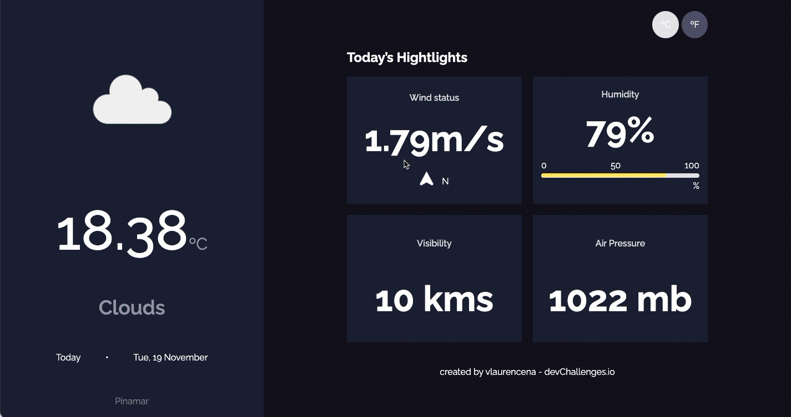

# Weather App

## Description
It is an app that displays weather information about user's location. User can choose to visualize info in metric or imperial system. 
## Built with
* HTML.
* CSS.
* JavaScript.
* React.
* React Router DOM.
* Axios.
* [Weather API](https://dashboard.heroku.com/apps/weather-app-vlaurencena/deploy/github).

## Installation and Setup Instructions
1. First, clone the repository to your local machine by running the following command in your terminal:

```bash
git clone https://github.com/vlaurencena/weather-app-react.git
```

2. Navigate to the project directory:

```bash
cd weather-app-react
```

3. Install the required dependencies:

```
npm install
```

4. Run the app:
```
npm start
```

5. Open your browser and go to the following URL to view the app:
```
http://localhost:3000/
```

## Extra Info
This project was built according to [devChallenges's weather app challenge](https://devchallenges.io/challenges/mM1UIenRhK808W8qmLWv).
